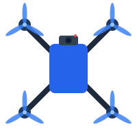
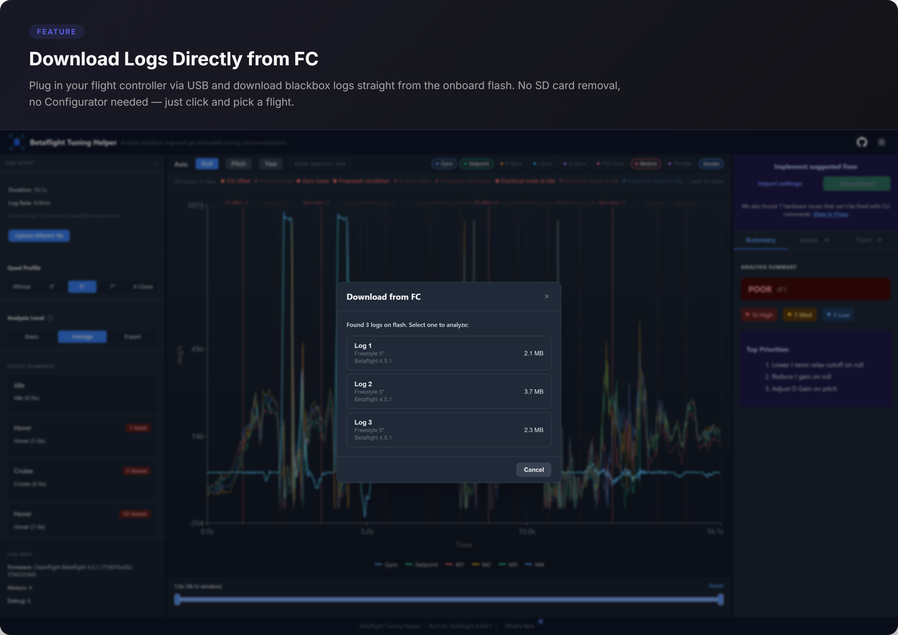
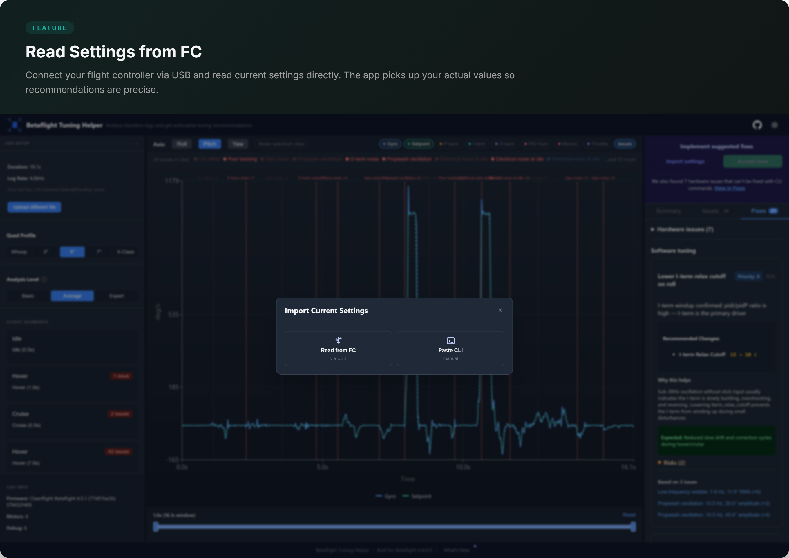
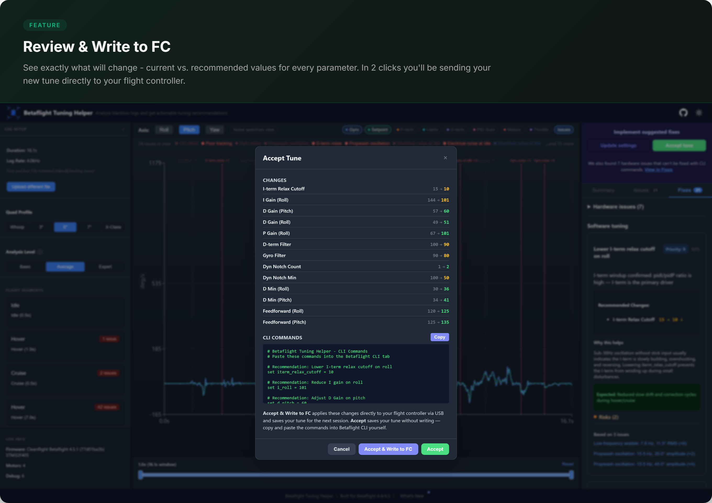
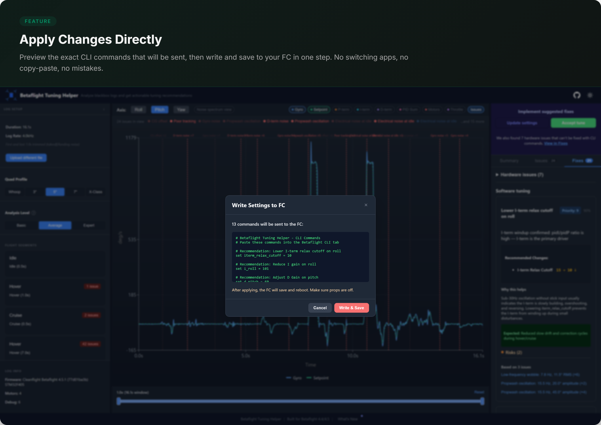
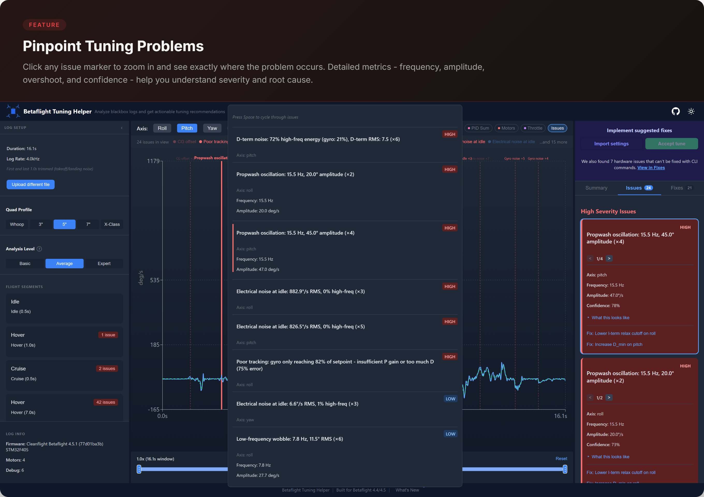
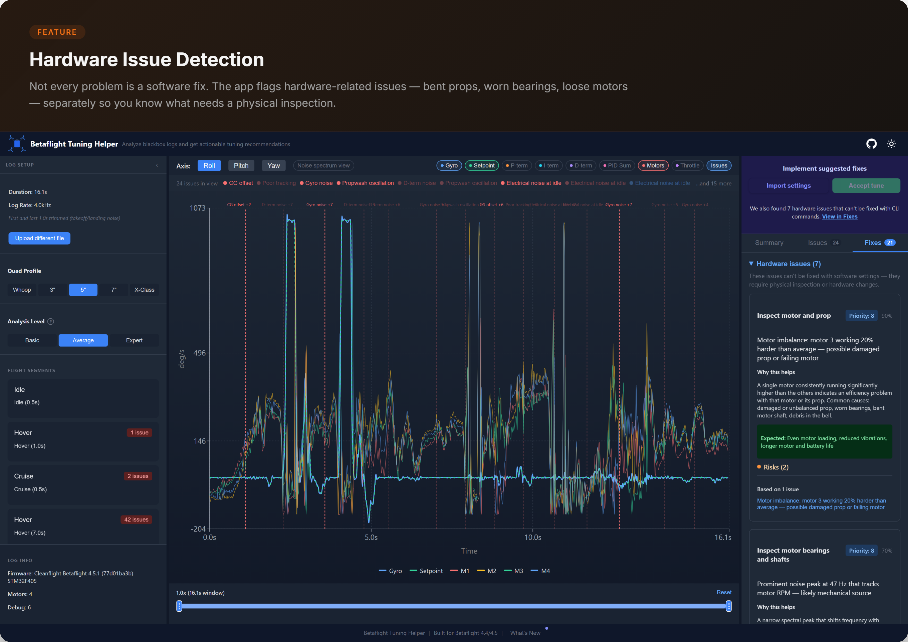
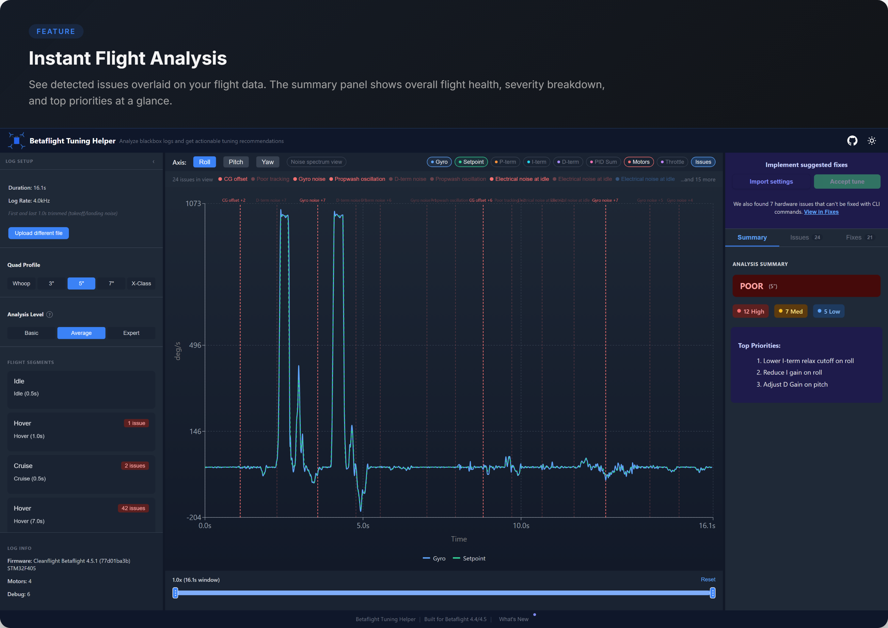
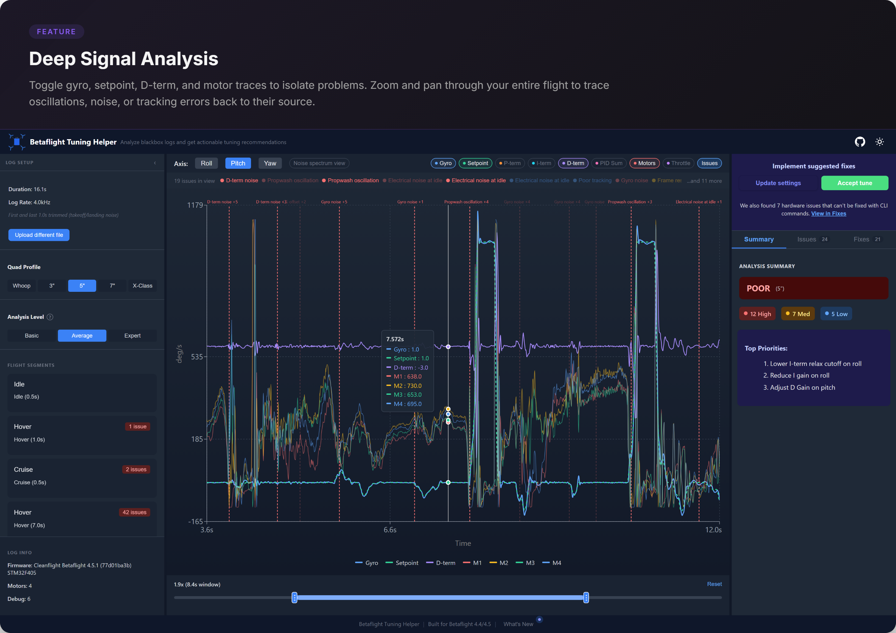
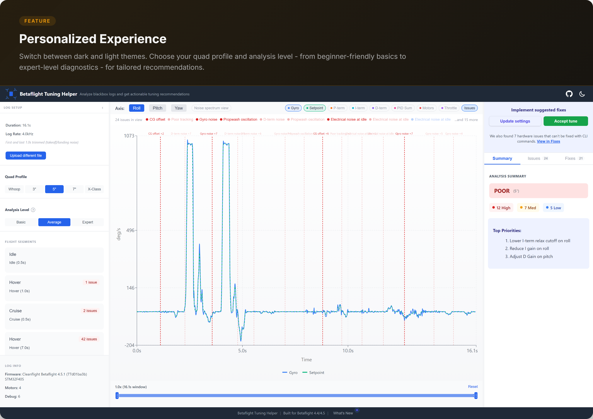

  

<h1 align="center">Betaflight Tuning Helper</h1>

  <strong>Plug in your quad via USB, download a Blackbox log, and get specific tuning recommendations — all in one place.</strong> 
  <a href="https://ricardo-marques.github.io/betaflight-tuning-helper/">Try it live</a>

Client-side web app that reads Blackbox logs directly from your flight controller via USB, analyzes them, and generates actionable tuning recommendations. Read your current settings and write changes back to the FC — no Configurator needed, no copy-pasting CLI commands. You can also upload log files manually if you prefer. No backend — everything runs in your browser.

## Why This Exists

PID tuning is one of the hardest parts of FPV. Most pilots either fly stock settings or spend hours in trial-and-error, changing one slider at a time and hoping for the best.

Blackbox logs contain all the data needed to diagnose problems — oscillations, propwash, bounceback, noise — but interpreting raw gyro/motor traces is expert-level knowledge. Existing tools like Blackbox Explorer show you the data, but don't tell you _what to change_.

This app bridges that gap. Plug in via USB, and it will:

- **Download logs directly from your FC** — read blackbox data from onboard flash, no SD card removal needed
- **Detect specific issues** (propwash, bounceback, noise, tracking errors, motor saturation, etc.)
- **Recommend parameter changes** with rationale, risk assessment, and confidence scores
- **Read and write settings to your FC** — import your current values and apply tuning changes directly
- **Speak Betaflight** — all output uses 4.4/4.5 slider terminology, ready to apply in the Configurator

Everything runs 100% client-side. No data leaves your browser, no account required.

## Features

**Direct FC connection** — Plug in your flight controller via USB and download blackbox logs straight from the onboard flash. The app scans the flash, finds individual logs, and lets you pick which flight to analyze. Uses the Web Serial API — no drivers or Betaflight Configurator needed. Once analyzed, read your current settings and write tuning changes back with a single click. (Requires Chrome/Edge.)

**Manual upload** — Prefer to work with files? Drop a `.bbl`/`.bfl` file, or a `.txt`/`.csv` export from Blackbox Explorer. Binary BBL parsing uses a native TypeScript parser (version-agnostic, no WASM dependency). Parsed in a Web Worker so the UI stays responsive. Handles 10MB+ logs.

**8 detection rules** — The rule engine analyzes overlapping time windows across roll, pitch, and yaw:

| Rule                      | Detects                                       | Key recommendations           |
| ------------------------- | --------------------------------------------- | ----------------------------- |
| Bounceback                | Overshoot after stick release                 | Adjust D / D_min              |
| Propwash                  | Oscillations during throttle drops            | Increase D_min, dynamic idle  |
| Wobble                    | Mid-throttle oscillations without stick input | Increase P / FF or filtering  |
| Tracking Quality          | Setpoint-to-gyro tracking error               | Adjust P, I, or FF            |
| Motor Saturation          | Motors clipping at 100%                       | Reduce master multiplier or P |
| D-term Noise              | Excessive D-term activity                     | Increase D-term filtering     |
| Gyro Noise                | High gyro noise floor                         | Increase gyro filtering       |
| High-Throttle Oscillation | Oscillations at high throttle (TPA)           | Adjust TPA rate/breakpoint    |

**Smart deduplication** — Issues are collapsed per type+axis (one entry regardless of how many windows detected it). Recommendations are deduplicated by parameter+axis so you never see two items targeting the same slider.

**Interactive chart** — Gyro, setpoint, PID terms, and motor outputs with per-axis selection, layer toggles, and zoom. Downsampled to 2000 points for smooth rendering.

**Betaflight-native output** — All recommendations use Betaflight 4.4/4.5 slider terminology with specific parameter changes, rationale, risk assessment, and confidence scores.

## How to Use

1. Go to the [live app](https://ricardo-marques.github.io/betaflight-tuning-helper/)
2. Plug in your FC via USB and click **Download from FC** to read blackbox logs directly from the flash (or drop a `.bbl`/`.bfl`/`.csv` file if you prefer)
3. Pick a flight and review detected issues and recommendations (analysis runs automatically)
4. Read your current settings from the FC via USB, or paste a CLI dump manually
5. Accept the tune and write changes directly to your FC — or copy the CLI commands to apply them yourself

## Known Limitations

- Multi-log BBL files: only the first log is parsed (most common case)
- Files > 50MB may slow the browser
- Simplified FFT (sufficient for tuning, not research-grade)

## Contributing

See [CONTRIBUTING.md](CONTRIBUTING.md) for development setup, project structure, and architecture details.

## License

MIT
